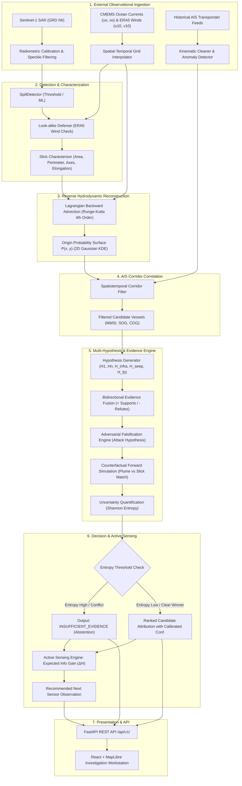

# SIH26143 System Architecture & Engineering Design

**Document:** `docs/architecture.md`  
**System:** Maritime Forensic Intelligence Engine  
**Version:** 1.0.0  
**Date:** 2026-09-29  

---

## 1. High-Level Architectural Diagram

The system operates across three tiers:
1. **Algorithmic Core (`src/`):** Pure scientific computing and forensic reasoning modules.
2. **API & Persistence (`app/api/`):** FastAPI async endpoints, schema validation, and storage.
3. **Investigation Workstation (`app/frontend/`):** High-density geospatial map interface.



---

## 2. Component Design & Inter-Module Interfaces

### 2.1 Detection Module (`src/detection/`)
- **Abstract Contract:** `SpillDetector.detect(scene: SatelliteScene) -> SpillDetectionResult`
- **Implementations:**
  - `ThresholdDetector`: Dynamic adaptive thresholding based on localized backscatter statistics ($\mu - k\sigma$) relative to ambient ocean clutter.
  - `LookalikeFilter`: Flags high look-alike risk when ERA5 wind speeds are $< 3\text{ m/s}$ (calm water specular reflection) or when slick gradient profile lacks steep damping edges.
- **Characterizer (`src/characterization/`):**
  - Computes Green's theorem polygon area ($\text{km}^2$), boundary perimeter, centroid $(lat_{c}, lon_{c})$, bounding box, principal orientation angle $\theta$, and elongation ratio $a / b$.

### 2.2 Drift Module (`src/drift/`)
- **Lagrangian Particle Mechanics:**
  $$\frac{d\vec{x}}{dt} = \vec{u}_{current}(\vec{x}, t) + \alpha \cdot \vec{u}_{wind10}(\vec{x}, t) + \vec{u}_{stochastic}$$
  where:
  - $\alpha = 0.032$ (wind drag factor with NH Coriolis deflection).
  - $\vec{u}_{stochastic} \sim \mathcal{N}(0, \sigma^2)$ parameterizes turbulent horizontal diffusion ($D_h \approx 10\text{ m}^2/\text{s}$).
- **Time Integration:** Explicit 4th-Order Runge-Kutta (RK4) integration with configurable timestep $\Delta t = 300\text{ s}$.
- **Backward Mode (Hindcast):** Integrates backwards ($-\Delta t$) from detected slick boundary particles.
- **Origin Surface (`src/drift/origin_surface.py`):**
  - Evaluates particle terminal locations using a 2D Gaussian Kernel Density Estimator (KDE) over a regular geospatial bounding grid, normalizing total probability volume to $\iint P(x, y) \, dx \, dy = 1.0$.

### 2.3 AIS Engine (`src/ais/`)
- **Cleaner (`src/ais/cleaner.py`):**
  - Rejects kinematic outliers: $SOG > 35\text{ knots}$ for commercial merchant ships, impossible accelerations ($> 1\text{ m/s}^2$), or invalid coordinates.
  - Computes `ais_gap_score`: identifies intervals where consecutive transmissions exceed expected Class A reporting intervals ($> 15\text{ minutes}$ during open-water transit).
- **Filter (`src/ais/filter.py`):**
  - Performs spatial bounding box and polygon containment queries to isolate candidate ships whose trajectories intersected the Origin Probability Surface within the estimated release window $[T_{sat} - \Delta t_{max}, T_{sat}]$.

### 2.4 Multi-Hypothesis & Evidence Engine (`src/hypotheses/`, `src/evidence/`)
- **Hypothesis Schema:**
  - $H_i: \text{Candidate Vessel } i$
  - $H_{infra}: \text{Offshore Platform / Subsea Pipeline Leak}$
  - $H_{seep}: \text{Natural Geological Seep}$
  - $H_{fp}: \text{False-Positive Look-alike}$
- **Evidence Ledger:**
  - Every hypothesis maintains an explicit list of positive $[+]$ and negative $[-]$ evidence objects.
  - Positive metrics: spatial containment probability, temporal release window alignment, trajectory orientation match, and forward drift consistency.
  - Negative metrics: vessel traveling against current direction, speed incompatible with continuous slick deposition, ship confirmed moored/anchored, or look-alike risk flagged.

### 2.5 Adversarial Falsification & Counterfactual Engine (`src/falsification/`, `src/counterfactual/`)
- **"Attack Hypothesis" Routine:**
  - Evaluates 5 automated challenge rules:
    1. *Spatial Overlap Challenge:* Is vessel track within the 95% origin probability boundary?
    2. *Kinematic Challenge:* Does vessel speed explain the length of the observed slick over the transit duration?
    3. *Drift Challenge:* If released at vessel coordinate $(x_v, y_v, t_v)$, would the oil have drifted to the observed satellite footprint?
    4. *Shape Challenge:* Does forward-simulated plume elongation and principal axis match the observed slick geometry?
    5. *Data-Quality Challenge:* Is AIS data continuity sufficient to support the claim, or are there untracked vessels nearby?
- **Counterfactual Metric:**
  - Computes the modified Hausdorff Distance $d_H(P_{sim}, P_{obs})$ and Intersection-over-Union (IoU) between the forward-simulated plume $P_{sim}$ and the observed satellite slick polygon $P_{obs}$.

### 2.6 Uncertainty Quantification & Abstention (`src/uncertainty/`)
- **Bayesian Posterior Computation:**
  - Normalizes evidence likelihoods into posterior probability distribution $p(H_k | E)$.
- **Shannon Entropy Metric:**
  $$H(p) = -\sum_{k} p(H_k) \log_2 p(H_k)$$
- **Abstention Policy:**
  - If $H(p) > H_{threshold}$ (high ambiguity) OR the difference between the top-two candidates $|p(H_1) - p(H_2)| < \delta$, the system returns:
    $$\text{DECISION} = \text{INSUFFICIENT\_EVIDENCE}$$
  - This prevents forced, arbitrary attribution on under-constrained incidents.

### 2.7 Active Sensing Engine (`src/evidence_selection/`)
- **Information Gain Optimization:**
  - Evaluates candidate next actions:
    1. `ACTION_SAR_REVISIT`: Task a high-resolution SAR satellite pass over candidate transit sector.
    2. `ACTION_OPTICAL_PASS`: Task Sentinel-2/PlanetScope multispectral scene to check emulsion/sunglint.
    3. `ACTION_AERIAL_PATROL`: Direct airborne/coast guard patrol to verify leading vessel's wake.
    4. `ACTION_AIS_DEEP_ANALYTICS`: Request historical satellite AIS records to bridge terrestrial transponder gaps.
  - For each action $a$, calculates the Expected Information Gain:
    $$\mathbb{E}[\Delta H(a)] = H(p) - \sum_{y} p(y|a) H(p(\cdot | E, y))$$
  - Ranks candidate actions by expected uncertainty reduction.

---

## 3. Data Flow & Provenance Model

Every analytical object produced by the pipeline inherits from a base `ForensicArtifact` dataclass:
```json
{
  "artifact_id": "art_20260929_152300_001",
  "incident_id": "CASE_001_WAKASHIO",
  "created_at": "2026-09-29T15:23:00Z",
  "module_name": "src.drift.origin_surface",
  "module_version": "1.0.0",
  "git_commit": "862540b",
  "parameters": {
    "num_particles": 500,
    "dt_seconds": 300,
    "wind_drag_factor": 0.032,
    "diffusion_coefficient": 10.0
  },
  "input_sources": [
    {"type": "satellite_scene", "id": "S1A_IW_GRDH_20200806"},
    {"type": "metocean_current", "id": "CMEMS_GLORYS_20200806"}
  ],
  "is_synthetic": false,
  "confidence_score": 0.88
}
```

---

## 4. Failure Modes & Fallback Strategies

| Component | Failure Mode | Fallback Strategy |
|---|---|---|
| **Satellite Ingestion** | Scene corrupted or missing geographic bounds | Reject scene with validation error; fall back to cached demo scenes if `DEMO_MODE=true`. |
| **Look-alike Defense** | Low wind detected ($u_{10} < 3\text{ m/s}$) | Mark detection as `LOOKALIKE_RISK_HIGH`; set detection confidence $\le 0.40$; recommend optical verification. |
| **Metocean Ingestion** | CMEMS API timeout or missing velocity grids | Fall back to local cached historical NetCDF/GRIB reanalysis; if unavailable, apply climatological drift model and broaden origin uncertainty envelope by $300\%$. |
| **AIS Ingestion** | Significant transponder silence ($> 6\text{ hours}$) | Compute `ais_gap_score`; generate $H_{dark}$ (untracked vessel hypothesis); refrain from assuming vessel innocence or guilt solely based on missing points. |
| **Attribution** | Two ships have nearly identical proximity and trajectories | Trigger `INSUFFICIENT_EVIDENCE` abstention; trigger Active Sensing Engine to identify which observation separates the two ships. |
